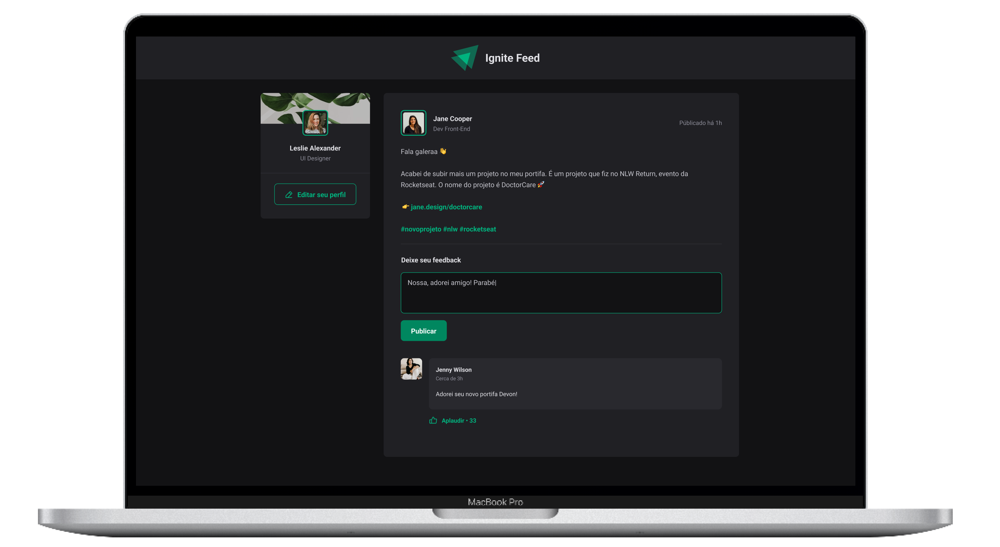

<p>
    <h1 align="center">
        
        &nbsp;
        Ignite Feed
        <br>

<a href="https://www.linkedin.com/in/omarcoaur3lio/">
    
</a>

<a aria-label="Completed" href="https://rocketseat.com.br/">
    </img>
</a>

<a href="./README.md">
    
</a>
    </h1>
</p>
<br>

<p align="center">
  <a href="#speech_balloon-Sobre">About</a>&nbsp;&nbsp;&nbsp;|&nbsp;&nbsp;&nbsp;
  <a href="#camera-Preview">Preview</a>&nbsp;&nbsp;&nbsp;|&nbsp;&nbsp;&nbsp;
  <a href="#hammer_and_wrench-Instalação">Setup</a>&nbsp;&nbsp;&nbsp;|&nbsp;&nbsp;&nbsp;
  <a href="#rocket-Tecnologias">Technologies</a>
</p>

## :speech_balloon: Sobre

This application was developed during the first module of [Rocketseat's](https://www.rocketseat.com.br/ignite) Ignite training program. During development, the main concepts of ReactJS were covered, the use of some `Hooks` such as `useEffect` and `useState`, as well as an introduction to TypeScript and technologies such as Vite.

Ignite Feed simulates a social network, where connected users can send comments to published posts, and can also delete them and give likes (`Aplaudir`).


## :camera: Preview 
<div align="center">
  
</div>

## :hammer_and_wrench: Instalação

To run the application on your machine, you must have the [Git](https://git-scm.com/book/pt-br/v2/Come%C3%A7ando-Instalando-o-Git) and [NodeJS](https://nodejs.org/pt-br/download/package-manager/) already installed, and also a package manager like [NPM](https://www.npmjs.com/) or [Yarn](https://yarnpkg.com/).
With these tools installed:

1. Clone this repository
```shell
git clone https://github.com/omarcoaur3lio/ignite-feed.git
```

2. Navigate to the created directory
```shell
cd ignite-feed
```

3. Install project dependencies
```shell
yarn # or npm i
```

3. Run the application
```shell
yarn dev # or npm run dev
```
The application will be available for access in your browser at http://localhost:3000

## :rocket: Tecnologias

- [Vite](https://vitejs.dev/)
- [ReactJS](https://reactjs.org/)
- [TypeScript](https://www.typescriptlang.org/)
- [Date FNS](https://date-fns.org/)
- [Phosphor Icons](https://phosphoricons.com/)

<p align="center">
Made with :purple_heart:
</p>
